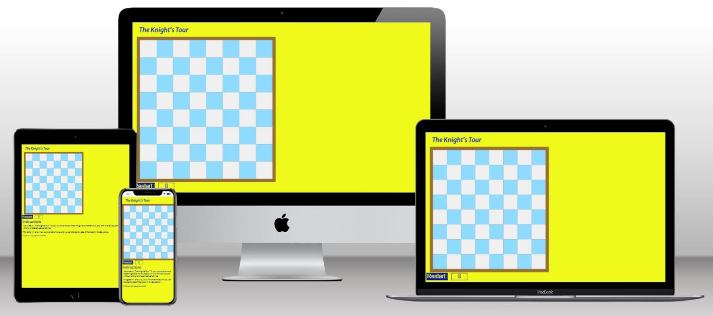
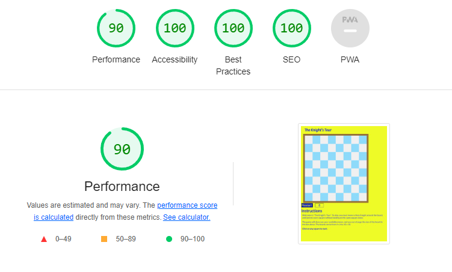

# Quicksilver IT Site

README.md file for my Code Institutute second project.

It is hosted on Github here:  
[The Knight's Tour](https://mark279455.github.io/KnightsTour/)  
The GitHub repository:  
[Mark Cooper Knights Tour Github Repository](https://github.com/mark279455/KnightsTour)

The Knights Tour is an old mathematics puzzle, in which you have to move a knight around a chessboard without landing on the same square twice.

As a mathematics problem it has a long history [Wikipedia](https://en.wikipedia.org/wiki/Knight%27s_tour)

It is possible to do, but it will take you a few attempts, there are lierally trillions of solutions.
There are also different classifications of solutions.

## Closed Tour
    This is where your from your last move you can go back to the place you started from.

## Open Tour
    This is where your starting point, and last move are not related. - if thats the right word

## Magic Square
    Drop a 1 on your first square, a 2 on the second, and continue to the end.
    Mathematical magic squares are where all the columns and rows and diagonals
    and quarters add up to the same number.

There are solutions you can find online if you look for them.

This version of the game is simple to play, and allows you to play on square boards between 4 x 4 and up to 15 x 15.

It is not easy to complete, but there are literally trillions of solutions.  
    THIS PAGE WILL SHOW YOU SOLUTIONS [Youtube Numberphile](https://www.youtube.com/watch?v=ab_dY3dZFHM)

--- 

# CONTENTS

* [User Experience](#User-Experience)
  * [Initial Thoughts](#Initial-Thoughts)
  * [User Stories](#User-Stories)

* [Design](#Design)
  * [Colours](#Colours)
  * [Typography](#Typography)
  * [Wireframes](#Wireframes)
  * [Features](#Features)
  * [Future Development](#Future-Development)
  * [Accessibility](#Accessibility)

* [Technology Used](#Technology-Used)
  * [Development Tools](#Development-Tools)

* [Deployment](#Deployment)

* [Test](#Tests)
  * [W3C Validator](#W3C-Validator)
  * [JSHint](#JSHint)
  * [Lighthouse](#Lighthouse)
    * [Index.html](#Index.html)
  * [Wave](#wave)
  * [Manual Testing](#Manual-Testing)
  * [Bugs](#Bugs)

* [Credits](#Credits)

--- 

## User Experience

### Initial Thoughts
The author became aware of this puzzle when they were at school, back in the late 70s.
Originally, the idea was to create a mutating board which could be any size by any size. (e.g. 6 by 8, or 17 by 3).
During development, it bacame obvious that this was going to be a problem, as on a small screen, the squares get too small to select.
One of the design wishes, was that the game should be completely responsive, so that in a browser window, the game would resize itself according to the window.

### User Stories  
    Requirements for the user:

    *   Instructions on how to play.
    *   The ability to see the next possible move(s).
    *   Results, and moves used.

- - - 
## Design

The site consists of 1 responsive page, index.html - this refers to a supporting css.page, and a javascript file - script.js.  
The logic for the game is in the javascript file, and the logic to resize the board is handled by the CSS.  
The code will resize and centre the chessboard until the screen is 640px wide, then it will anchor it to the
left side with a margin of 20px.

### Colours

The Colours used have been changed a few times during development.  
The decision was made to change to a paler colour chessboard to contrast more with the red and blue of the knights.  
The brighter background was chosen to make the page brighter, and the blue text to contrast with that.

### Typography

The fonts used are from Google Fonts.  
They are:  
    *   Lato - sans-serif  
    *   Merriweather - sans-serif

The creator is ot a fan of serif fonts.

## Wireframes

Wireframes were created using Balsamiq for the following screen widths:

320 - 600 px wide
601 - 640 px wide
641px = and wider

### Index.html - 320 to 600px wide

### Index.html - 601 to 640px wide

### Index.html - 641px and wider

## Features

### Resizing

    The board will resize according to the dimensions of the display it is opened on.  
    The board will resize dynamically when a compute browser window is resized.

    Wide screen (754) showing the max board size of 600px, and its anchoring to the left by 20px

    Narrower screen (424) showing the same board resized to fill the viewport.

### Highlighting

    Possible moves are highligted, during play, and invalid moves cannot be made.

### design of Knights used

    During development, different styles of the chess piece were sourced and edited for use. When it came to
    a decision to pick one, the designer decided to keep all three, and let the code randomly decide which set to use.

### Instructions and Results
    
    The Instructions and results are shown in the same space in order that when played on smaller displays the end of game results are visible.

    Moves made during play are shown at the end of the game

### Future Development

It would be nice to write some functionality where you could backup your moves, and go back to the last square that you moved to and then continue.
An option to play a "Magic Square" game, where instead of leaving a knight on your last square, you leave a number, and the game will calculate whether or not you have created a "[Magic Square](#Magic-Square)". 

---
## Accessibility

Wave Accessibility tool was used throughout development and for final testing of the deployed website to check for any aid accessibility testing.

Testing was focused to ensure the following criteria were met

Color contrasts meet a minimum ratio as specified in WCAG 2.1 Contrast Guidelines
Heading levels are not missed or skipped to ensure the importance of content is relayed correctly to the end user
All content is contained within landmarks to ensure ease of use for assistive technology, allowing the user to navigate by page regions
All not textual content had alternative text or titles so descriptions are read out to screen readers
HTML page lang attribute has been set
Aria properties have been implemented correctly
WCAG 2.1 Coding best practices being followed
Manual tests were also performed to ensure the website was accessible as possible and some accessibility issues were identified.

---

## Technology Used

    *   HTML
    *   CSS
    *   Javascript
    *   Google Fonts

### Development Tools

    Git
    GitPod
    Chrome Dev Tools
    techsini site to provide images for README

---

## Deployment

The website has been deployed using Github pages.

on Github, goto settings and then pages.
deploy from branch, main and root.

The site uses relative references, and so deployment in a local environment requires only a web server and a dedicated directory for the project

### Version Control
The site was created using the Gitpod and pushed to github to the remote repository ‘KnightsTour’.  

The following git commands were used throughout development to push code to the remote repo:

*   git add <file> - This command was used to add the file(s) to the staging area before they are committed.
*   git commit -m “commit message” - This command was used to commit changes to the local repository queue      ready for the final step.
*   git push - This command was used to push all committed code to the remote repository on github.

### Deployment to Github Pages
    The site was deployed to GitHub pages. The steps to deploy are as follows:

    *   In the GitHub repository, navigate to the Settings tab
    *   From the menu on left select 'Pages'
    *   From the source section drop-down menu, select the Branch: main
    *   Click 'Save'
    *   A live link will be displayed in a green banner when published successfully.
            The live link can be found here -   
            [The Knight's Tour](https://mark279455.github.io/KnightsTour/)

### Clone the Repository Code Locally
Navigate to the GitHub Repository you want to clone to use locally:

    *   Click on the code drop down button
    *   Click on HTTPS
    *   Copy the repository link to the clipboard
    *   Open your IDE of choice (git must be installed for the next steps)
    *   Type git clone copied-git-url into the IDE terminal
    *   The project will now of been cloned on your local machine for use.

---

## Tests 

Tests were done on the index page to ensure responsiveness on screen sizes from 320px and upwards as defined in [WCAG 2.1 Reflow criteria for responsive design](https://www.w3.org/WAI/WCAG21/Understanding/reflow.html).

### W3C Validator
The index.html file was validated successfully by the W3C validator.

* [Index Page](https://validator.w3.org/nu/?showsource=yes&doc=https://mark279455.github.io/KnightsTour/index.html)

* [Styles.css](https://validator.w3.org/nu/?showsource=yes&doc=https://mark279455.github.io/KnightsTour/assets/css/style.css)

The style.css file was verified by the W3.org CSS Validator page.

## JSHint

script.js was tested with the [JSHint code analysis tool](https://jshint.com/), and no errors were reported.

## Lighthouse

Lighthouse initially gave slower results than required. Images on the site were converted from .jpg to to .webp format, this successfully improved the loading times and raised the Lighthouse scores to be 90% or over.

### index.html

## Wave

index.html

Wave gave an error concerning an input field that was missing a form label. 

This was overcome by adding an aria label.

### Alerts
    Wave shows one alert - saying that the info3 field was a possible heading.
    It is not a heading.

### Manual Testing

    A testing procedure was implemented to test functionality of the puzzle.

    1.  Setting the option to change board size works

        Maximum size

        Minimum size

    
        Intermediate size

    
        Default size

    

    2.  Hint moves displayed correctly   
        Testing for hint moves to be correct, and also that squares previously visited are not "hinted".

        In the board centre

        At the board edge.

        At not the first move.

    3.  The completed and incomplete games produced the correct display, both in effects  and the results displayed

        Completed puzzle.

        Incomplete puzzle.

    4.  The input taken for board size was valid.

        Invalid input.

    5.  During the game, the only inputs available to the user are the hint squares and the restart button (and input field). It was tested that evrything else was inactive or non-responsive.

    The implmentation has been tested extensively using Chrome, Edge, Firefox and Opera browsers.

### Bugs

Everything works as designed, and the author is unaware of any bugs that exist.

---

## Credits

Credits are due to...

    *   Gareth_mentor for his advice and recommendations.
    *   ger_ci for help and advice with javascript coding.
    *   Stackoverflow  
        https://stackoverflow.com/questions/3416454/how-to-make-an-empty-div-take-space
        https://stackoverflow.com/questions/4171286/how-to-make-a-div-with-no-content-have-a-width
    *   YouTube
        https://www.youtube.com/watch?v=u9HJDC3I_Qg

---
